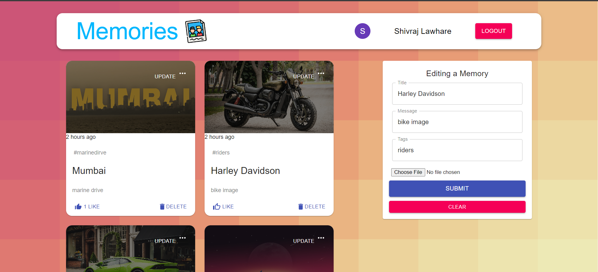

# 

Welcome to Memories App! 🌟 This full-stack web application built with the MERN stack allows you to capture and cherish your precious memories.

## 🚀 Features

- **User Authentication**: Securely sign up and log in to access your memories.
- **Google Account Login**: Conveniently log in using your Google account.
- **Create Memories**: Craft your personal memories with images, tags, and titles.
- **Engage with Memories**: Like, update, or delete your memories.

## 🌐 Demo

Experience Memories App live: [Memories App](https://memories-app2603.netlify.app/)
Demo Video: [Memories App](./client/src/images/video.mp4)

## 🛠 Tech Stack

- **Frontend:**
  - React.js
  - React Redux
  - Material UI
  - Axios
  - React OAuth/Google
  - React Router

- **Backend:**
  - Node.js
  - Express.js
  - MongoDB (Mongoose)
  - Jsonwebtoken
  - Bcryptjs
  - Cors

## 🚀 Getting Started

1. **Clone the repository:**
   ```bash
   git clone https://github.com/shivrajlawhare/Memories-App.git

2. **Navigate to the project directory:**
    cd Memories-App

3. **Install dependencies:**
    cd client && npm install
    cd ../server && npm install

4. **Set up your MongoDB database and update configuration files.**

5. **Start the development server:**
    cd client && npm start
    cd ../server && npm start

6. **Visit http://localhost:3000 in your browser.**


